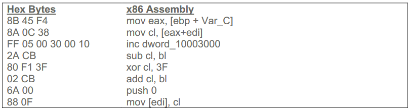

## Introduction
In this assignment, a folder containing different samples for the following 4 questions will be given. However, I will not be uploading those samples. Those samples are actually based off from an old Yara CTF which can be found in this URL: https://blog.korelogic.com/blog/2015/08/17/yara-ctf-1. Solutions are provided in that blog. Some slight variations were made to the given samples by school.

## Question 1
Write a yara rule that fulfils all following conditions:
1. The detected file has a MZ header.
2. The section names of the sample suggest that it is related to UPX.
3. Contains the signature that suggest it is UPX.
4. Optimized the yara rules using “pe” module. Provide explanation under the meta-section.

## Question 2
Yara can be applied on email content. Write a yara rule to detect all emails in the folder “part 2” that focus on 3 different aspect.
1. Email Subject using regular expression.
2. Attachment filename based on strings only.
3. Message body based on strings only.

## Question 3
Yara can be applied on email attachments as well. Write a yara rule that detects attachments which is zip file (without unzipping the attachment), that contains the common PE file extension (.exe, .dll and .scr).
1. Recognizing Zip-file.
2. Writing a for-loop to iteratively look for local file header of a zip file and search for the file extension.

## Question 4
Look at the following assembly code. Write a code-based (based on hex bytes) Yara rule that detects similar code structure. A useful hint would be that mnemonic hardly changes but operands usually change.
1. Using of wildcards:
	* Using 14 wild cards or lesser or
	* Using 9 to 10 wild cards or lesser: after taking in consideration on type of variables.
2. Looking for alternative opcode.
3. Provide explanation under the meta-section for part (1) and (2).

  

