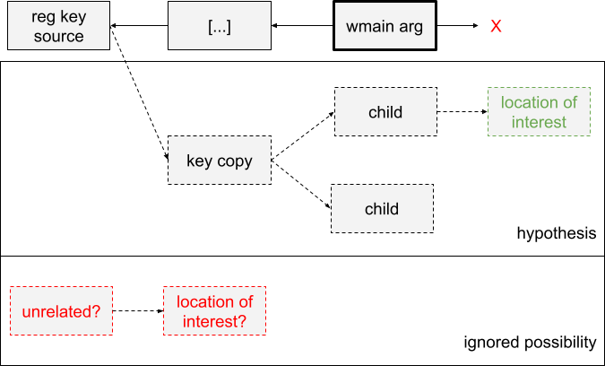

# Guided Exercise: The case of -p


---

* **Guided Exercise: The case of -p**
* Classification: __RESTRICTED__
* _CATEGORY_: Tutorial

---


Uncovering code of interest: data tainting & trace diff


## Introduction

The question we will try to answer in this exercise is:

> What is the -p parameter used for if passed to the svchost command line when starting a Windows service?

This will strengthen our understanding of how to use the taint effectively, and get us to use the python API as a complement to the analysis, all in the context of uncovering an unknown behavior.

As a bonus, if you have the `ltrace` tool, it will demonstrate how we can use it to compare two traces.

We will use two pre-recorded traces. In both, we start the BITS service in a copy of `svchost.exe` named `abchost.exe` . The use of a binary copy is to prevent that service from starting inside an existing service host process. See the exact command line used in the annexes at the end of the document.

This notebook will make use of a scenario that is provided alongside this module.

Please run the following cell to automatically make sure the scenario is imported and get a working trace. If it isn't already, it will take about 20 minutes.

<div class="alert alert-block alert-info">
<b>Note:</b> if you already have this scenario, the cell will simply not import it.
</div>


```Python
from IPython.display import HTML, display

import reven2  # noqa: F401
import reven2.preview.taint
from reven2.address import LinearAddress, LogicalAddress, LogicalAddressSegmentIndex, PhysicalAddress  # noqa: F401
from reven2.arch import x64 as regs  # noqa: F401
from reven2.preview.project_manager import ProjectManager
from reven2.preview.taint import Tainter

import sys
sys.path.append("../")
import utils

pm = ProjectManager("http://reven:8880/")
utils.import_scenario(pm, "./scenario/dashp-regkeypolicy_17dda890-b2bb-4ebb-afc1-ad44c0862fe8.zip")
```

 The first thing we'll need to do is find the command line used in memory, because we want to locate the code region which reads this parameter. We assume the code will do something like the code below: look for the character `p` in the command line, then set a flag or trigger a call when it finds it.

```c
for(int i = 0; i < arg_nb; ++i) {
    if (strcmpi(arg[i], "p") == 0) {
        flag = 1;
        // or
        special_method();
    }
}
```

Hence, when we find the command line in memory, we can safely focus on its `p` parameter byte only, and ignore the rest of it.


## Finding the command-line parameter's location

Open Axion on the trace `dashp-regkeypolicy`. How can we find the command line? Take a moment to think about how you could do that - there are multiple approaches. Try out the methods you can think of.

For the sake of the exercise, we'll start by searching for the call to main(), then look at the arguments here:

1.  Search for `abchost!wmain` in the trace. Notice how there are two matches: the first one triggers a page fault immediately, then the OS maps the memory region, and finally gets called a second time. This is a very frequent behavior, where the OS lazily maps memory on demand. You can use "Step out" to skip the page fault, or go straight for the second match.
2.  The signature of `wmain` is similar to that of main: `wmain(int argc, wchar_t *argv[ ], wchar_t *envp[ ])`. Locate the `p` parameter: you should be looking at address 0x24d38c44a60.
3.  First, let's get into a dead-end and do something that will give us **no results**: taint this address forward to try to see where it is used (never forget to set the starting transition right when starting a new taint) - You get no results: this value is never used. Really?
4.  Let's check: open up the memory history on that `p` parameter. There are no memory reads after the beginning of `wmain`, so this wasn't a problem with how we started our taint - either the program never reads that argument, or it uses other means of accessing it.

That first approach did not yield interesting results. Let's assume that we do not know anything about which calls could be used to read arguments here. Instead, we will backtrack a bit in the hope of getting more information: there may be other copies of that parameter elsewhere in the trace.

1.  When we looked at the memory history on `p`, we saw write accesses prior to the call to `wmain`. This parameter does come from somewhere, so taint it backward and look for the source, go directly to the last result. When starting a taint, always make sure you updated your From / To transition fields. When a taint yields unexpected results, double check you updated these values.
2.  You should be at transition #61537229. Look at the backtrace: does it make sense, considering where we entered this command line according to the annex? Also, take a look at which program is reading this key.
3.  You can connect WinDbg at that point to get the name and path of that registry key if you are curious.


## What to do with that source?

Let's take a moment to sum up our findings so far. We started with `wmain`, which did not help us find the location where the `-p` parameter is used in any way:


We tainted backward and found the source of that parameter:


Since we know the command line is configured via a registry key, at that point it would seem pretty safe to assume that this key's content is used elsewhere.

1.  Let's have a look at the memory history on address 0xffffa80c5d51e67c (location of the character in the registry key being read). Double click on the following accesses and each time look at the backtrace - are these the locations we are looking for?

Well, not really - there are only key reads. That makes sense: this source memory is stored in kernel memory, then copied by the call to a user-land address, etc. So, similar to the previous figure, the actual locations we want to look into will be descendants of that region, and we don't want to track them manually.

Moreover, we should probably keep in mind that there may be other sources for this command line parameter - another registry read using a different source address (although it's unlikely), or anything else really. But it is not necessary to try and predict all possibilities - we have a strong candidate to explore first.

So, for the rest of the exercise, we will concentrate on the following hypothesis:



1.  Take a moment to taint 0xffffa80c5d51e67c forward: there are many results. We will need to refine this approach.


## Refining the taint results

We have many taint results that we need to interpret. Notice that flags get tainted from time to time - this means the value has been tested or compared against something: that is exactly what we are looking for! But parsing them manually would be a chore, so we will switch over to the Python API to help us. Please note that you have a reference of the script we are going to build in the Annexes.

First, let's connect to our trace. This notebook assumes the scenario is named `My First Tutorial Scenario`, which should be the case by default.


```Python
pm = ProjectManager("http://reven:8880/")

try:
    server = pm.get_server_by(name="dashp-regkeypolicy")
    trace = server.trace
    print(f"Successfully connected to the trace - it is {trace.transition_count} instructions long")
except Exception as e:
    print(f"An error occurred when opening the scenario: {e}")
```

You should see the message:
> Successfully connected to the trace

In that case, we are all set and ready to go!

1.  Let's build a python loop to iterate over those results and filter results out to keep flags only. In the project manager, in the Analyze section of this project, click on "Open Python".
2.  First of all, translate the taint you did earlier in the GUI, in python API. You can refer to the taint documentation or the cookbook's.
3.  Iterate on all the changes, and print them all. How many are there?
4.  Try to make the print prettier: do not print the change itself but its transition number, and its current location (using something like `change.transition.context_before().ossi.location()`).


```Python
print(trace.transition_count)

# Fill the rest
```


Now that we have our basic look, it's time to refine it.

1.  On each change, you can iterate on tainted registers using `tainted_registers` as illustrated below. Change the printing loop to skip changes that do not refer to a flag. Ideally, we should even consider gained taint only: filter out if `len(list(markers.gained)) == 0`.
    ```python
    # Parse registers whose taint changed
    for regs, markers in change.tainted_registers():
    ```
2.  Filtering the results helps, but that is not enough. Could we simply start looking at transition related to our binary? Filter results based on location's binary. Note the location can be None, in which case you can ignore it: it is not our binary either.
3.  At this point, we get 4 results only! This is much easier to analyze by hand. For the record, try to remove the filtering based on register type: we now get 6 results (or a bit more if you did not filter on gained taint only). That is still a manageable number of results, although it is nice to get the API to do as much as possible for us.

If you can use IDA and especially a decompiler on abchost.exe, that would probably help with the following step.

1.  Read the code at these locations, and try to identify where we check the parameter character, and what is the direct consequence of the valid check against `p`.

You should find that there is a flag set to 1 at address 0x24d38c4460c. Why is this flag not tainted? This is an important characteristic of the taint: it does not consider the control flow.


## Following the flag

In this section we will guide you through the rest of our analysis using the GUI only.

1.  Open the memory history on 0x24d38c4460c at #93808643. This is where we write that flag to 1.
2.  We see there is only one following read access before this value is overwritten with something different. Go to that read access's transition: it's moved to a register!
3.  We don't want to track that by hand. Go back to the write access, and start a taint forward on that flag.
4.  You may get a single result. What is going on? Well in that case you started a taint on a memory address that gets overwritten on that same transition, so the taint stops there. Start the taint from the next transition instead.
5.  Again, we're interested in register flags getting tainted. Find the first result tainting one - we take a conditional jump because this value is not 0. What does the code do in this branch?
6.  That's right! Another flag. Rinse and repeat, taint this new flag at address 0x24d38c44610 forward from transition #94080483 (not #94080482, or you will get the same 1-result taint!)
7.  Locate the first taint results where a flag register is tainted. You should look at #106252066.
8.  Look at the trace and the calltree: what are the calls that follow this final flag test?


## Trace diff

Was our analysis comprehensive? Well, there is always room for more, but it seems we got a pretty good understanding of the effect of this parameter. Still, it would be nice to confirm everything.

We recorded a second trace in a similar setup, except we removed the `-p` parameter from the command line. This trace is called `dashp-regkeypolicy-nodashp`. As we did at the top of this notebook, use the following cell to import & replay the trace if not alreay done, and then to connect to it:


```Python
utils.import_scenario(pm, "./scenario/dashp-regkeypolicy-nodashp_3825fae8-78bb-484c-92db-d81afdb3be0a.zip")
```

```Python
try:
    server_nodahsp = pm.get_server_by(name="dashp-regkeypolicy-nodashp")
    trace_nodahsp = server_nodahsp.trace
    print(f"Successfully connected to the trace - it is {trace_nodahsp.transition_count} instructions long")
except Exception as e:
    print(f"An error occurred when opening the scenario: {e}")
```

1.  Can you find the calls to `SetProcessMitigationPolicy` in this trace?

If you have access to the ltrace utility, you can run it on both trace, targetting `abchost.exe`. Then, using your favorite diffing tool, make a diff of both outputs. If you can, spend some time to set up your tool to ignore transition numbers, or addresses. This will really help make the differences pop up. The tool called meld (Windows or Linux) is good at that: you can configure regexps for patterns to ignore.

The command is as follows:

```
python3 -u -m reven2_ltrace --port <reven_port> "c:/windows/system32/abchost.exe" | tee dashp.log
```

Alternatively, if you don't have the `ltrace` command, you can use the following cell to parse the calltree & print out-going calls from `abchost`. Run it on both `trace` and `trace_nodahsp`, and save the output separately to compare them:


```Python
binary = next(server.ossi.executed_binaries("abchost"))
start = next(trace.search.binary(binary=binary))
it = start.stack.frame().descendant_events()
for event in it:
    if isinstance(event, reven2.stack.FrameStart):
        loc = event.frame.function_location()
        if loc is not None and "abchost" not in loc.binary.name:
            it.skip_children()
            if loc.binary.name in ["ntoskrnl"]:
                continue
            print(loc)

#
# If you managed to view this diff in the best conditions, the differences should be really easily visible. Outside the context of an exercise, and assuming we had the confirmation our parameter did have an effect, this would have been a good place to start!
#
```

## Conclusion

And that's it for this exercise. By now you should have a better understanding of the taint feature, its exact perimeter, and how to effectively use it best. You also saw how different approaches to the same problem yield different levels of understanding, and how quick a trace diff can provide high-level information.


## Annexes

### Annex 1. Recording steps

In order to record these traces, here are the steps we took:

We created a copy of `svchost.exe` from a Windows 10 system to start the Background Intelligent Transfer service (BITS) implemented in `qmgr.dll`, and make sure it would start its own instance of the `svchost.exe` binary (otherwise multiple services tend to be aggregated into a single process). We also had to create a registry key to activate the `SetMitigationPolicy` behavior

1.  Create registry key HKEY_LOCAL_USER\System\CurrentControlSet\Control\SCMConfig\EnableSvchostMitigationPolicy as DWORD key with a content of 1.
2.  Copy `svchost.exe` to `abchost.exe`
3.  Reconfigure BITS to use its own copy of svchost: sc config BITS binPath= "C:\Windows\system32\abchost.exe -k netsvcs -p"
4.  Start recording, then start the BITS service: net start BITS
5.  Wait until the service has started, then stop recording.


### Annex 2. Taint script example

```Python
# This assumes you are already connected to the trace, see the cell above in the document.

# Taint setup
mem_to_taint = reven2.preview.taint.TaintedMemories(0xFFFFA80C5D51E67C, 0x1)
first_context = trace.transition(61537229).context_before()
last_context = trace.last_context

# Start the taint
tainter = Tainter(trace=trace)
taint = tainter.simple_taint(tag0=mem_to_taint, is_forward=True, from_context=first_context, to_context=last_context)

# Wait for all results. Usually, you should start iterating right away
changes = list(taint.accesses(changes_only=True).all())

print("{} taint results".format(len(changes)))

# iterate over all changes in tainted data
for change in changes:
    change_loc = change.transition.context_before().ossi.location()

    # Skip if not in our binary
    if change_loc is None or "abchost" not in change_loc.binary.name:
        continue

    # Parse registers whose taint changed
    for registers, markers in change.tainted_registers():
        # Skip registers that did not gain some taint at that transition
        if len(list(markers.gained)) == 0:
            continue

        # If this register is a flag, print that transition
        if registers.register.category.name == "flags":
            output = change.transition._repr_html_()
            output += " " + str(change_loc)
            display(HTML(output))

            # Do not print that transition multiple times for multiple flags tainted
            break
```


